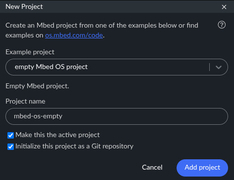
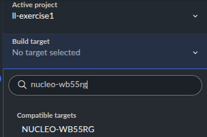

STM32 Nucleo WB55RG board exercises with Mbed
=============================================

Introduction
------------

These exercises are designed for mbedOS. The easiest way to use them are using Keil Studio Online. Go to:

  https://studio.keil.arm.com/

Create an account and then click on ``File`` then ``New`` then ``Mbed project``:



Then select "NUCLEO-WB55RG" as target:



It will have a single code file (```main.cpp```) with the following content:

```python
#include "mbed.h"

int main()
{
    while (true) {

    }
}
```

You can compile by clicking on this button:


Note: the first time it takes a while, the rest of the times it is faster.

And you will see how you download a binary file, that you can then upload to LabsLand.

Setting up the peripherals
--------------------------

The STM32 Nucleo WB55RG board incorporates the following diagram:


A simple hello world would be:
```c++
#include "mbed.h"

// BASIC PERIPHERALS

// LEDs to show available slots
DigitalOut led1(PB_13);  // Green LED1
DigitalOut led2(PB_14);  // Green LED2
DigitalOut led3(PB_15);  // Green LED3

// switches and buttons
DigitalIn sw1(PB_2);
DigitalIn sw2(PB_4);
DigitalIn sw3(PB_11);
DigitalIn sw4(PB_12);
DigitalIn sw5(PA_6);
DigitalIn sw6(PB_9);
DigitalIn sw7(PB_8);

DigitalIn btn1(PC_5);
DigitalIn btn2(PC_6);
DigitalIn btn3(PC_10);
DigitalIn btn4(PC_12);

UnbufferedSerial pc(USBTX, USBRX, 115200);

int main()
{
    while (true) {
        if (led1 != sw1) {
            printf("Toggling led1\n");
            led1 = sw1;
        }
        ThisThread::sleep_for(10ms);
    }
}
```
